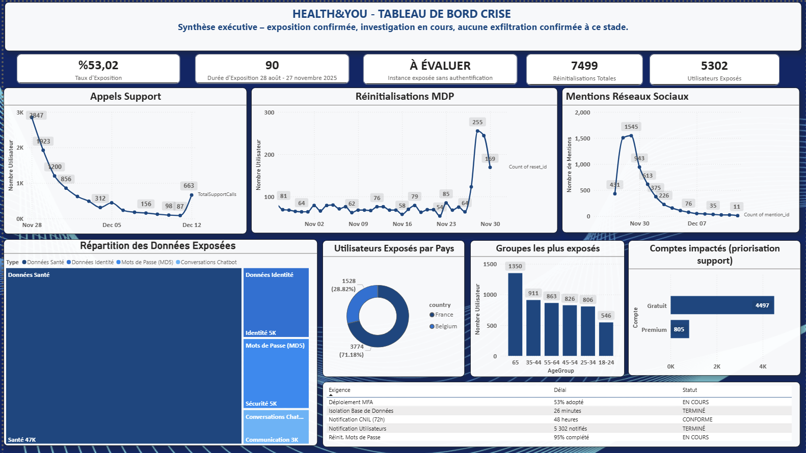
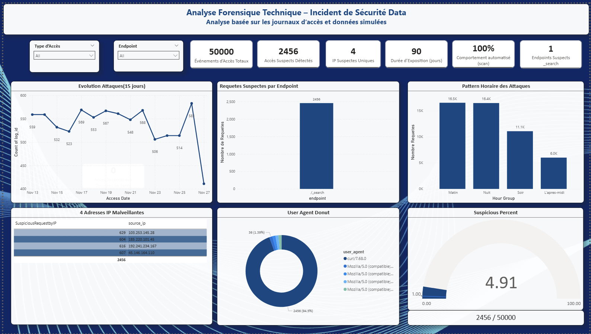
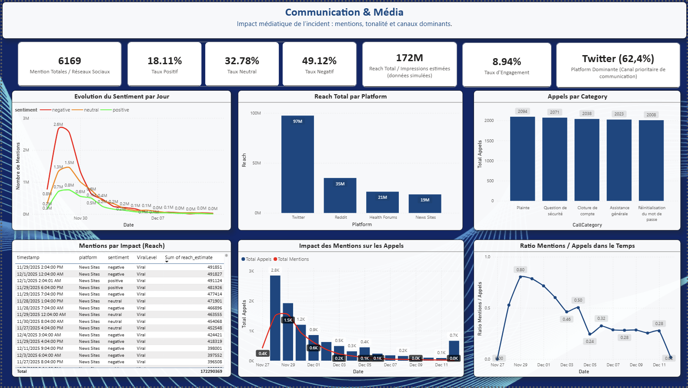
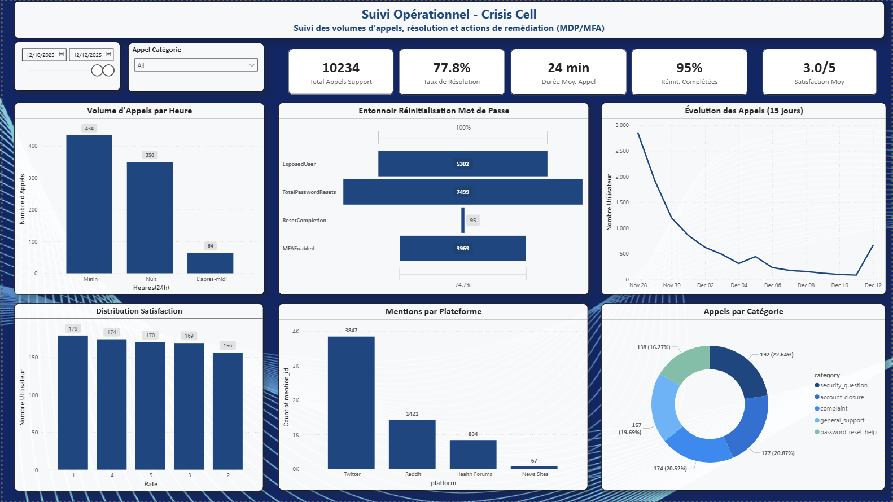

# Health&You — Incident Response & Crisis Management Dashboard

> **EN** | A Power BI project simulating a data breach incident response for a fictional health app, Health&You.  
> **FR** | Un projet Power BI simulant la gestion d'un incident de violation de données pour une application de santé fictive, Health&You.

-------------------------------------------------------------------

## Dashboards

### 1. Tableau de Bord Crise — Executive Overview

> **EN** Executive summary: exposure rate, password resets, exposed users by country and age groups.  
> **FR** Synthèse exécutive : taux d'exposition, réinitialisations MDP, utilisateurs exposés par pays et groupes d'âge.

### 2. Analyse Forensique Technique — Security Forensics

> **EN** Access log analysis: 50,000 events, 2,456 suspicious accesses, 4 malicious IPs, 100% automated behavior.  
> **FR** Journaux d'accès : 50 000 événements, 2 456 accès suspects, 4 IP malveillantes, comportement automatisé à 100%.

### 3. Communication & Média — Media Impact

> **EN** Media impact: 6,169 mentions, 172M impressions, Twitter dominant channel (62.4%), daily sentiment evolution.  
> **FR** Impact médiatique : 6 169 mentions, 172M impressions, Twitter canal dominant (62,4%), sentiment par jour.

### 4. Suivi Opérationnel — Crisis Cell Operations

> **EN** Support call tracking, MDP/MFA reset funnel, user satisfaction and mentions by platform.  
> **FR** Suivi des appels support, entonnoir MDP/MFA, satisfaction utilisateur et mentions par plateforme.

-------------------------------------------------------------------

## How It Works / Comment ça fonctionne

Python (Faker) → Synthetic Database (.xlsx) (10,000 users · 50,000 access logs · 90 days health data) → Power BI (.pbix) → 4 Dashboards(Crisis · Forensics · Media · Operations)

-------------------------------------------------------------------

## Technologies
Tool : Python - Faker - Pandas for Synthetic data generation,
       Jupyter Notebook for Data exploration,
       Microsoft Power BI for Dashboard creation
